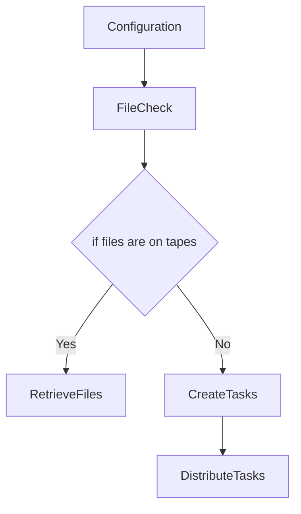

# Description
The tool must get information about what data it needs to plot as well as where to find it and it should produce the plots.

I will introduce some abstraction to make a cleaner implementation.

In a first stage, it should take the configuration file and create, for each time-step needed, an object containing:
- the time-stamp
- the file with the data
- the output name

I added another abstraction with two classes:
FileDealer() -> Pointing to the data folder, has some methods to provide a DataFile based on the date
DataFile() -> Pointing to a specific file, keeping track of all requests that will use the file and with methods to check whether the file is in disk and to retrieve it from tapes otherwise.

In a second stage, we will check for each time-step if the output file already exists, keeping only the ones that are still missing.

In a third stage, we will check if the files are already in the disk or are in tapes. Giving the opportunity to trigger file retrieval directly from the tool.

In case the files are there, we can create the plotting tasks.

Questions:
- Does it make sense to split the PlotRequest object from the PlotTask object?
- Should PlotTasks be individual for each plot or be grouped by a file/files?
# FlowChart

# Stage 1:
From configuration to PlotRequest object.
- [x] Create PlotRequest object.
- [x] Create function to generate all plot requests from a configuration.
      Should I keep a reference to the configuration in the PlotRequest?
- [x] Create DataFile and FileDealer classes to handle interaction with file system and retrieve the file corresponding to each Request.
- [ ] Create a PlotTask for each PlotRequest. Should I add this as directly as a method of the request?